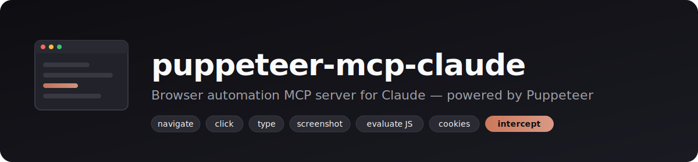

# puppeteer-mcp-claude

<p align="center">
  
</p>

[](https://www.npmjs.com/package/puppeteer-mcp-claude)
[](https://www.npmjs.com/package/puppeteer-mcp-claude)
[](https://github.com/jaenster/puppeteer-mcp-claude/actions/workflows/ci.yml)
[](https://nodejs.org/)
[](LICENSE)

A [Model Context Protocol](https://modelcontextprotocol.io) server that gives Claude Code (and any other MCP-aware client) a real browser via Puppeteer — navigate pages, click and type, run JavaScript, capture screenshots, manage cookies, intercept requests.

## Requirements

- Node.js ≥ 18
- An MCP-aware client (Claude Code, Claude Desktop, Cursor, Codex CLI, …)
- Chromium is downloaded automatically by Puppeteer on first install (~170 MB)

## Install

**macOS / Linux**

```bash
curl -fsSL https://raw.githubusercontent.com/jaenster/puppeteer-mcp-claude/main/install.sh | bash
```

**Windows (PowerShell)**

```powershell
iwr -useb https://raw.githubusercontent.com/jaenster/puppeteer-mcp-claude/main/install.ps1 | iex
```

Both scripts verify Node ≥ 18, install the package globally via npm, and register it with Claude Code at user scope. Override scope with `SCOPE=project` (bash) or `$env:SCOPE='project'` (PowerShell).

**Manual** — if you'd rather not run a remote script:

```bash
npm install -g puppeteer-mcp-claude
claude mcp add puppeteer-mcp-claude -- npx -y puppeteer-mcp-claude serve
```

Then restart Claude Code and ask: *"Take a screenshot of example.com"*.

## Tools

You don't have to call `puppeteer_launch` first — the browser auto-launches with defaults the moment any other tool runs. Page ids default to `"default"`, so single-tab flows can omit `pageId` entirely.

| Tool | What it does |
|-|-|
| `puppeteer_launch` | (Optional) launch a browser or connect to an existing Chrome via `browserWSEndpoint`. Use this for stealth mode, proxies, custom viewport, etc. |
| `puppeteer_new_page` | Open a new tab. |
| `puppeteer_navigate` | Go to a URL. |
| `puppeteer_click` | Click a CSS selector. |
| `puppeteer_type` | Type into an input. |
| `puppeteer_get_text` | Read `textContent` of an element. |
| `puppeteer_screenshot` | Capture a PNG — returned inline as an MCP image block, optionally also saved to disk. |
| `puppeteer_evaluate` | Run a JS expression in page context, returns the value. |
| `puppeteer_wait_for_selector` | Wait until an element appears. |
| `puppeteer_close_page` | Close a tab. |
| `puppeteer_close_browser` | Close the whole browser. |
| `puppeteer_set_cookies` / `puppeteer_get_cookies` / `puppeteer_delete_cookies` | Cookie jar management. |
| `puppeteer_set_request_interception` | Block resources by type or inject request headers. |

### Response format

Every tool returns its result in two parallel forms:

- `content[0].text` — **[TOON](https://toonformat.dev) (Token-Oriented Object Notation)**, a compact, schema-aware JSON alternative. Good for hosts that pipe the text body straight into the model's context.
- `structuredContent` — the same data as a typed JSON object, for MCP clients that prefer machine-readable output.

Which one your host uses is up to the host — both are MCP-spec-compliant. Typed clients that want the object without depending on `structuredContent` can `import { decode } from '@toon-format/toon'` and parse `content[0].text`.

## Examples

How an LLM would typically drive this server — each example shows the prompt you'd give Claude and the tool sequence it produces.

### Take a screenshot of a site

> "Take a screenshot of news.ycombinator.com."

```text
puppeteer_navigate { url: "https://news.ycombinator.com" }
puppeteer_screenshot { fullPage: true }
```

Returns the PNG as an inline image block (Claude sees it directly), plus structured `{ bytes, path: null, fullPage: true }`.

### Scrape article titles

> "Give me the titles of the top 10 stories on Hacker News as a markdown list."

```text
puppeteer_navigate { url: "https://news.ycombinator.com" }
puppeteer_evaluate { script: "[...document.querySelectorAll('.titleline > a')].slice(0,10).map(a => a.textContent)" }
```

Claude formats the resulting array into the requested markdown list.

### Fill a form

> "On example.com, fill the search box with 'TOON' and submit."

```text
puppeteer_navigate { url: "https://example.com" }
puppeteer_type   { selector: "input[name=q]", text: "TOON" }
puppeteer_click  { selector: "button[type=submit]" }
puppeteer_wait_for_selector { selector: ".results" }
puppeteer_get_text { selector: ".results h1" }
```

### Reuse an existing logged-in browser

> "Connect to my running Chrome and take a screenshot of the GitHub dashboard."

```bash
# In one terminal
puppeteer-mcp-claude chrome 9222
# Sign in to GitHub once in the launched Chrome window.
```

```text
puppeteer_launch { browserWSEndpoint: "ws://localhost:9222" }
puppeteer_navigate { url: "https://github.com" }
puppeteer_screenshot {}
```

Avoids re-doing login flows in every session.

### Block images for faster scraping

> "Scrape the article text from <url> as quickly as possible."

```text
puppeteer_set_request_interception { enable: true, blockResources: ["image","media","font","stylesheet"] }
puppeteer_navigate { url: "<url>" }
puppeteer_get_text { selector: "article" }
```

## CLI

```text
puppeteer-mcp-claude install [--scope user|project|local]   Register with Claude Code
puppeteer-mcp-claude uninstall [--scope ...]                Remove from Claude Code
puppeteer-mcp-claude status                                 Show "claude mcp list"
puppeteer-mcp-claude serve                                  Run the MCP server on stdio
puppeteer-mcp-claude chrome [port] [userDataDir]            Launch Chrome with remote debugging
puppeteer-mcp-claude help                                   Show help
```

## Development

```bash
pnpm install
pnpm build
pnpm test           # node:test via tsx, ~165 tests
pnpm dev            # run the server directly from src/
```

## Other MCP servers I maintain

- [**remote-shell-mcp**](https://github.com/jaenster/remote-shell-mcp) — persistent SSH, SFTP, port forwarding, and Docker over MCP. Long-running daemon so sessions, tunnels, and PTY shells survive across Claude Code / Claude Desktop / Cursor / Codex CLI restarts.
- [**node-debugger-mcp**](https://github.com/jaenster/node-debugger-mcp) — real Node.js debugger over MCP. Breakpoints, stepping, scope inspection, eval, source-map-aware BPs, child-process and worker-thread auto-attach. Speaks the V8 Inspector Protocol.

## Links

- [npm package](https://www.npmjs.com/package/puppeteer-mcp-claude)
- [Issues](https://github.com/jaenster/puppeteer-mcp-claude/issues)
- [Changelog](CHANGELOG.md)
- [Model Context Protocol docs](https://modelcontextprotocol.io)

## License

MIT
